# RUNNER A.P.E.R

## Player's Manual

*Athens Piraeus Electric Railways* · for the ZX Spectrum 48K / 128K · cassette

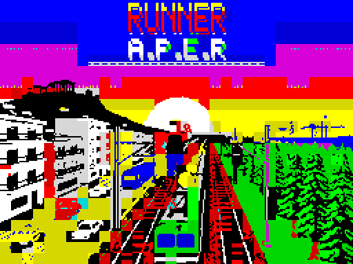

---

## Loading

1. Switch on your ZX Spectrum (48K, 128K, +2 or any machine that runs 48K software).
2. Put the **RUNNER** cassette in the recorder and rewind it.
3. On a 48K: type `LOAD ""` (**J**, then **SYMBOL SHIFT + P** twice) and press **ENTER**.
   On a 128K or +2: choose **Tape Loader** from the menu.
4. Start the tape.

The loading screen appears first, then the game loads. After a few minutes the main menu comes up.

In an emulator you can also open `runner.tap` / `runner.tzx`, or the snapshots `runner48.z80` and `runner128.z80`,
which start at the menu at once.

> On a **128K** the music plays on the AY sound chip, in the game too. On a **48K** the sound effects play on the
> beeper and the tunes play on the menu screens only.

---

## The story: The Last Souvlaki Man

It's 6:47 a.m. in Kiato. Your uncle Babis, the finest souvlaki man in Piraeus, has just called you in a total panic.
At noon the judge of the "Golden Skewer" contest arrives at his shop, and Babis has left Grandma's secret spice in
Kiato: a little jar labelled "DO NOT TOUCH, BABIS".

You head for the suburban train. It's cancelled "due to the unforeseen presence of a goat on the line". There's no
taxi either, because the only taxi driver in Kiato is Babis himself.

So you run along the tracks with the jar in your pocket. You jump the buffer stops. You climb onto the roofs of
trains that, strangely, run perfectly on time for everyone except you. You grab coins for the ticket you never had
time to buy.

The ticket inspector has been chasing you since Loutraki. So has the goat.

If you don't make it, Babis will season the skewers with supermarket oregano. In Piraeus, that is never forgiven.

**RUN!**

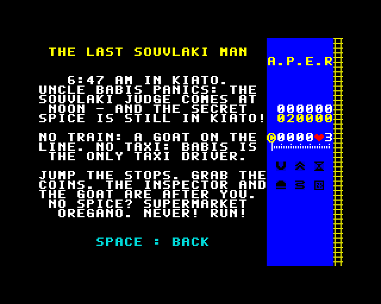

---

## The main menu

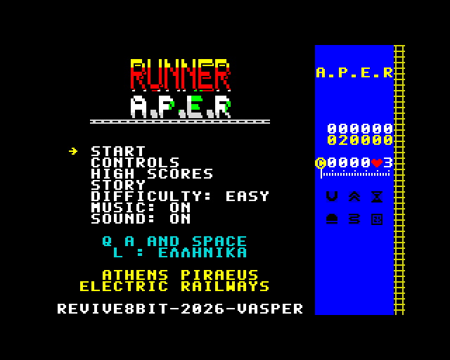

Move with **Q** and **A** (or the joystick) and choose with **SPACE**, **ENTER** or **FIRE**.

| Option | What it does |
|---|---|
| START | Starts a run |
| CONTROLS | Shows the keys |
| HIGH SCORES | The 8 best runners |
| STORY | Why on earth you are running |
| DIFFICULTY | EASY / MEDIUM / HARD |
| MUSIC | Tunes on or off |
| SOUND | All sound on or off |

Press **L** to switch between English and Greek. If you leave the menu alone for a while, the game shows a **demo**;
press any key to come back.

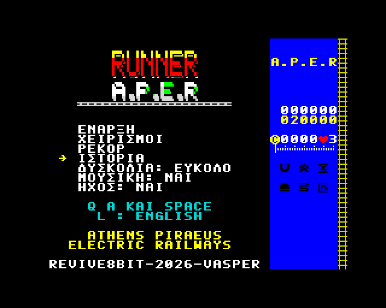

---

## Controls

| Action | Keyboard | Joystick |
|---|---|---|
| Move one lane left | `O` | left |
| Move one lane right | `P` | right |
| Jump | `Q`, `SPACE` or `ENTER` | up or FIRE |
| Land quickly | `A` | down |
| Pause / continue | `H` | — |
| Music on/off | `M` | — |
| Give up, back to the menu | `BREAK` (`CAPS SHIFT` + `SPACE`) | — |

The game reads a **Kempston** joystick (found by itself when the game starts) and a **Sinclair** joystick
(Interface 2 or the 128K's left port: keys 6–0) at the same time as the keyboard.

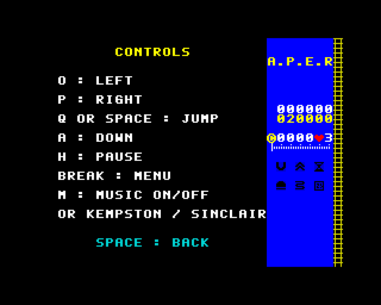

---

## Playing the game

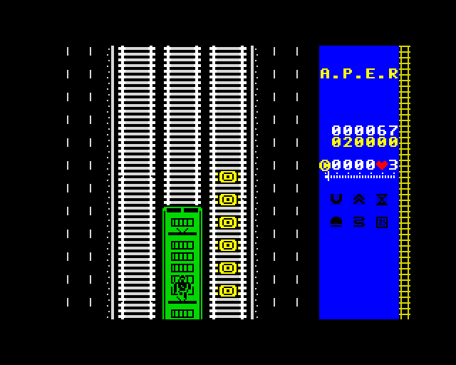

You run at the bottom of the screen and the line comes towards you from the top. There are **three tracks**. Change
lane to dodge what is ahead, jump to clear it, and pick up every coin you can. While you are in the air you fly
**over** coins and power-ups and don't collect them, so time your jumps.

Every run starts with a countdown: **3, 2, 1, GO!** On **HARD** the game first warns you to jump between the wagons.

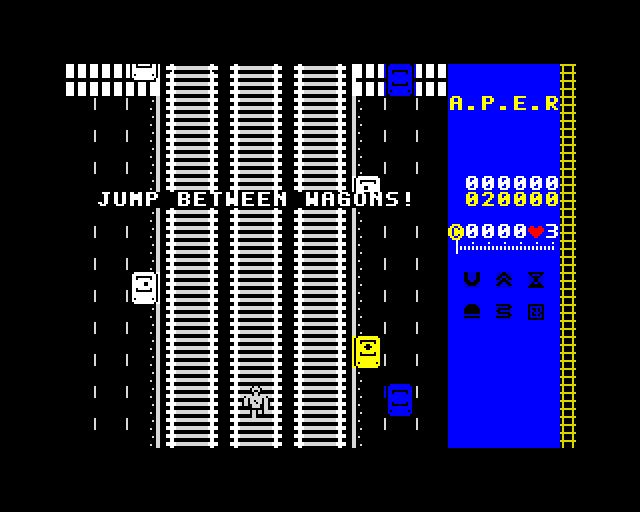

The line runs through the **city**, beside a busy avenue full of cars, buses and kiosks, and out into the
**forest**. Footbridges and road bridges pass overhead. The longer you run, the more crowded the tracks get.

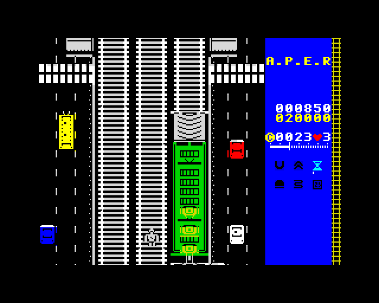

### Difficulty

| Level | Speed | Special |
|---|---|---|
| EASY | normal | Obstacles get denser slowly, never more than 2 on one track in a screen |
| MEDIUM | about 25% faster | Obstacles get denser faster |
| HARD | faster still | You must **jump the gaps between wagons** when you run on the roofs |

### Heights

The runner gets bigger on screen the higher he is.

| Height | Where you are |
|---|---|
| 1 | On the ground |
| 2 | Jumping from the ground: clears buffer stops |
| 3 | On a train roof |
| 4 | Jumping on a roof, over the wagons |
| 5 | The highest jump above a train |

### Lives

You have **3 lives**. After a crash you are protected for a moment. When the last life is gone, the game is over.

---

## The screen

The track takes up three quarters of the screen. The panel on the right is the train's dashboard:

- your **score** and the **best score**;
- your **coins** and the **lives** left;
- the **route** from Kiato to Piraeus, with your place on it;
- all six **power-ups**: dark when you don't have them, lit with a time bar while they run;
- at the bottom, **PAUSE** while the game is paused (and **DEMO** in the demo).

## The route

You run from Kiato to Piraeus: **Corinth, Megara, Elefsina, Aspropyrgos, Rentis, Piraeus**. The bell rings and the
station's name appears on the track as you pass it, with its platforms on either side of you.
**Piraeus gives 1000 points**, and then the route starts again.

---

## Power-ups

A power-up turns up every 50 to 150 rows, never right in front of an obstacle. Some sit on the train roofs:
take the ramp to reach them. When you take one, its name appears on the track.

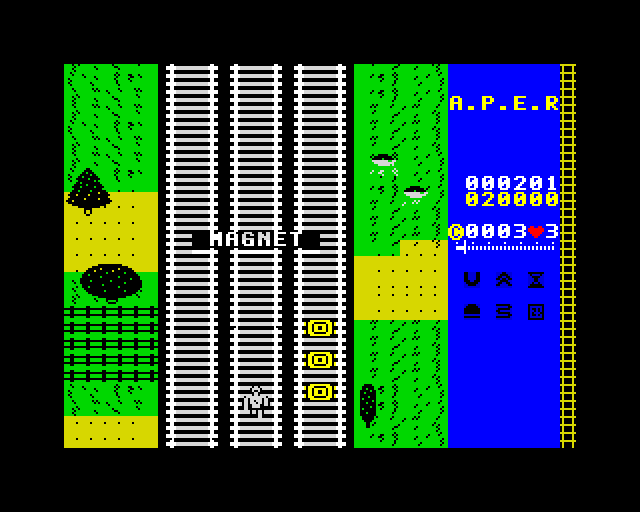

| Power-up | Effect | Lasts |
|---|---|---|
| Coin | 10 points | — |
| TURBO | Faster, distance counts double (the most common) | 8 s |
| SLOW | Half speed: a breather | 8 s |
| MAGNET | Pulls in the coins of the lanes next to you | 10 s |
| SUPER JUMP | Jump from the ground right over a train | 10 s |
| HELMET | Saves you from one crash | until hit |
| 2X COINS | Every coin is worth double | 15 s |

TURBO and SLOW cancel each other.

---

## Obstacles

| Obstacle | How to get past |
|---|---|
| Wagon | Change lane, run up a ramp, or use the SUPER JUMP |
| Gap between wagons | On HARD only: jump it when you run on the roofs |
| Locomotive | Don't meet one head-on at ground level! |
| Ramp | Takes you up onto the roof; the end of the train takes you back down |
| Buffer stop | Jump it or change lane |
| Signal | Always red on this line: change lane, or jump high over it |

---

## Scoring and high scores

```
score = distance (x2 with TURBO) + coins x 10 (x2 with 2X COINS)
```

If your score makes the top 8, type your initials: **Q A** choose a letter, **SPACE** accepts it. The table is kept
until you switch the Spectrum off.

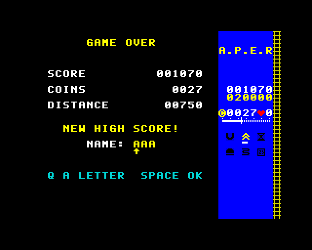

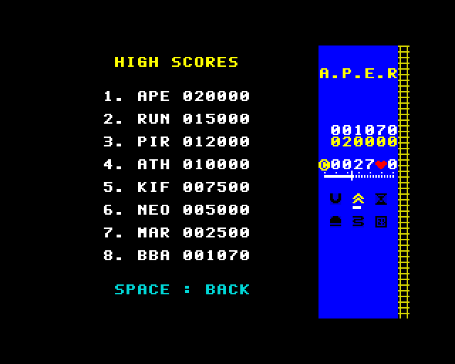

---

## Hints and tips

- Coins on a train roof mean a ramp is near: go up and collect them.
- Don't jump too early: in the air you miss the coins.
- Keep the HELMET for the crowded stretches. It is used up on the first crash.
- SLOW is your friend on HARD when the tracks get full.
- Watch for signals from far away: they leave you little time.

---

## Credits

**REVIVE8BIT · 2026 · VASPER**

Runner A.P.E.R: Z80 code, graphics, music and story, first written for the Amstrad CPC 6128 and brought to the
ZX Spectrum. Inspired by the Athens–Piraeus electric railway (Line 1).

*No goats were harmed in the making of this game.*
